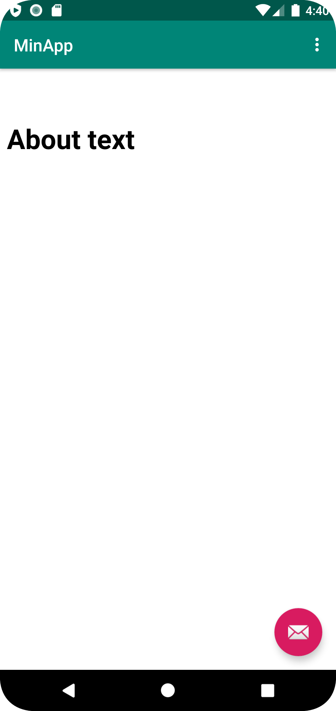

# Rapport

Skapade en external och en internal webview. Genom att ange en länk inom "showExternalWebPage" från en extern websida. Även att ange en länk inom "showInternalWebPage" från en HTML-fil, skapad i Android Studio.
För att hämta dessa länkar så används "myWebView.loadUrl()" inom "showExternalWebPage()" och "showInternalWebPage()". Dessa funktoiner kallas sedan när användaren vill byta mellan "external web page" eller "internal web page" i menyn.


```
public class MainActivity extends AppCompatActivity {

    WebView myWebView;

    public void showExternalWebPage(){
        myWebView.loadUrl("https://his.se");
    }

    public void showInternalWebPage(){
        myWebView.loadUrl("file:///android_asset/about.html");
    }

    @Override
    public boolean onOptionsItemSelected(MenuItem item) {

        int id = item.getItemId();

        if (id == R.id.action_external_web) {
            Log.d("==>","Will display external web page");
            showExternalWebPage();
            return true;
        }

        if (id == R.id.action_internal_web) {
            Log.d("==>","Will display internal web page");
            showInternalWebPage();
            return true;
        }

        return super.onOptionsItemSelected(item);
    }
}

```




